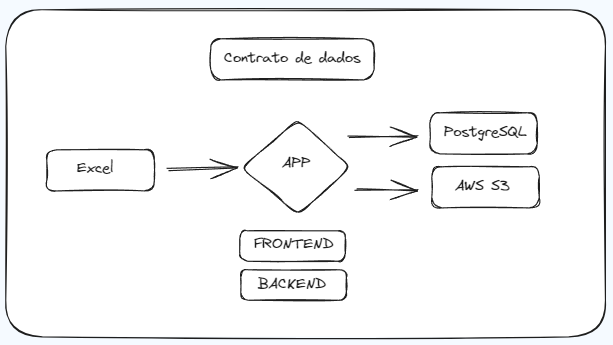

## Acesse a aplicação
- https://data-project-from-zero-wk01.streamlit.app/

### Instalação e Configuração

#### 1. Clone o repositório:

```bash
git clone https://github.com/lorenzouriel/data-project-from-zero-wk01.git
cd data-project-from-zero-wk01
```

#### 2. Configure a versão correta do Python com `pyenv`:

```
bash
pyenv install 3.11.5
pyenv local 3.11.5
```

#### 3. Instale as dependências do projeto:

```bash
python -m venv .venv
# O padrao é utilizar .venv
source .venv/bin/activate
# Usuários Linux e mac
.venv\Scripts\Activate
# Usuários Windows
pip install -r requirements.txt  
```

### Arquitetura


#### Arquitetura do Contrato de Dados


- Link para a Documentação do Contrato de Dados: https://lorenzouriel.github.io/data-project-from-zero-wk01/

---
---
---
---
### Access the aplication
- https://data-project-from-zero-wk01.streamlit.app/
### Installation and Configuration

#### 1. Clone the repository:

```bash
git clone https://github.com/lorenzouriel/excel-validation-wk-00.git
cd excel-validation-wk-00
```

#### 2. Configure the correct Python version with `pyenv`:

```
bash
pyenv install 3.11.5
pyenv local 3.11.5
```

#### 3. Install project dependencies:

```bash
python -m venv .venv
# Default is .venv
source .venv/bin/activate
# Mac and Linux Users
.venv\Scripts\Activate
# Windows users
pip install -r requirements.txt  
```

### Architecture


#### Data Contract Architecture


- Link for Data Contract Documentation: https://lorenzouriel.github.io/data-project-from-zero-wk01/