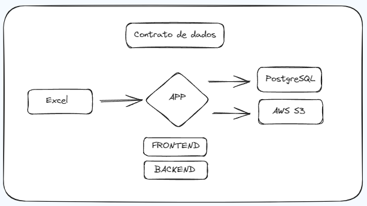

# Validador de Schemas Excel - Contratos de Dados

## Contracts
### `src.contrato.Vendas`
```python
class Vendas(BaseModel):

    """
    Modelo de dados para as vendas.

    Args:
        email (str): email do comprador
        data (datetime): data da compra
        valor (int): valor da compra
        produto (str): nome do produto
        quantidade (int): quantidade de produtos
        categoria (str): categoria do produto

    """
    email: EmailStr
    data: datetime
    valor: PositiveFloat
    produto: str
    quantidade: PositiveInt
    categoria: CategoriaEnum
```

#### Arquitetura do Contrato de Dados

